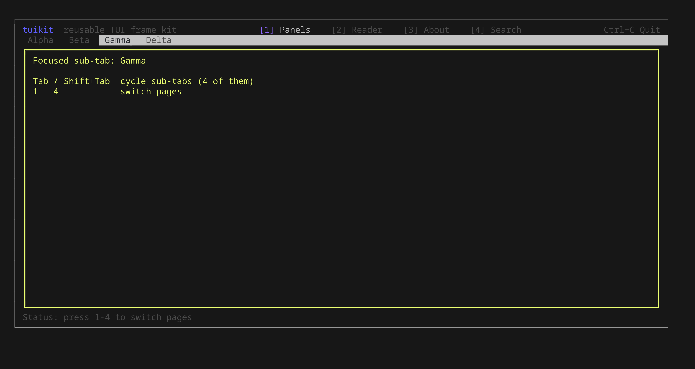
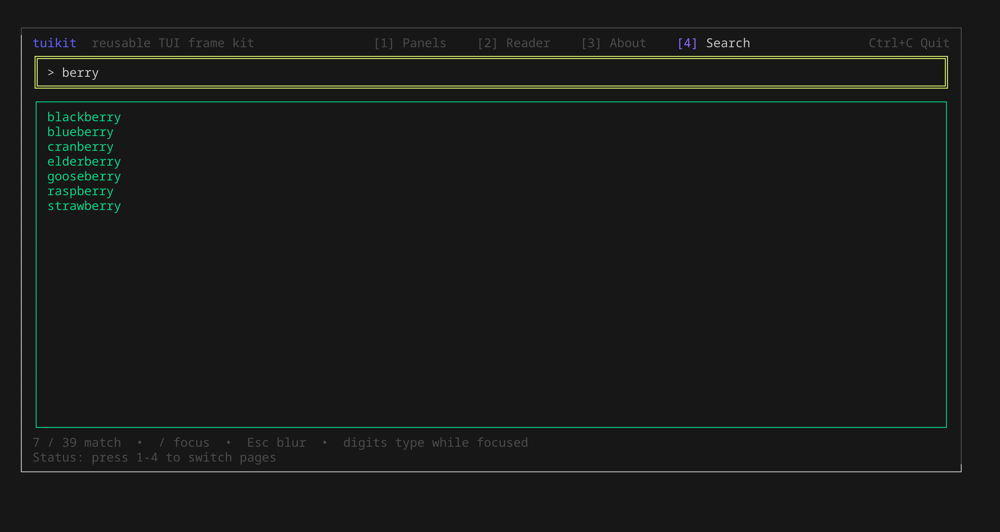
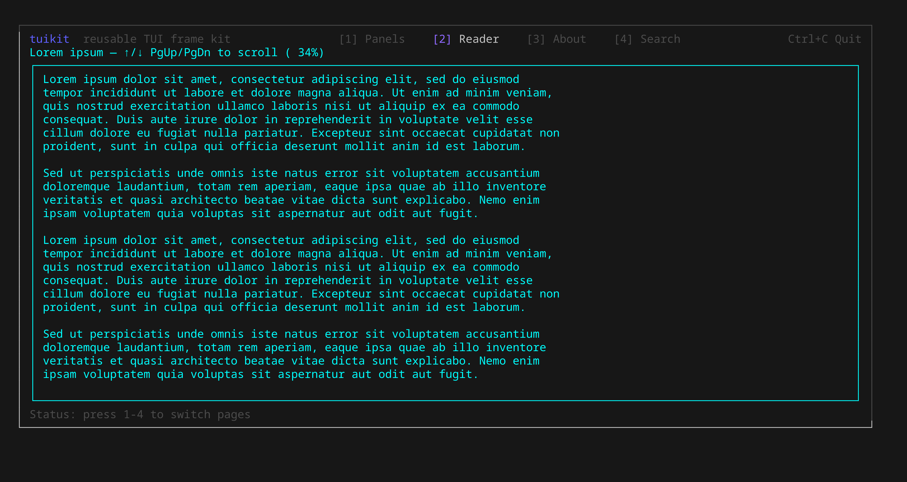
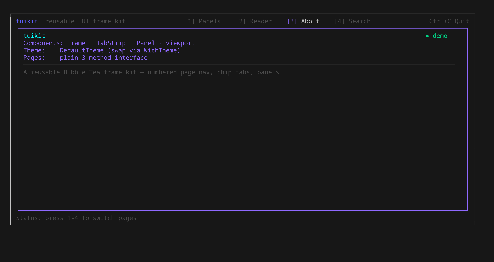

# tuikit

A small, reusable [Bubble Tea](https://charm.land) frame kit: the structural
chrome you rebuild in every terminal app — a numbered page wrapper with
navigation, chip tabs, and bordered panels — decoupled from any one app and
driven by a swappable theme.

## Screenshots

From the demo (`go run ./examples/demo`):

| Panels — chip sub-tabs + focused panel | Search — live filter, page-nav suppressed |
| --- | --- |
|  |  |

| Reader — scrolling viewport | About — layout helpers |
| --- | --- |
|  |  |

## Components

- **`Frame`** — a stateful `tea.Model` that hosts a list of pages, renders a
  numbered header (`[1] Foo  [2] Bar …`), delegates the body to the active page,
  and draws a status footer. Number keys `1`–`9` switch pages; `Ctrl+C` quits.
- **`Page`** — the seam you implement, a plain 3-method interface:
  ```go
  type Page interface {
      Title() string
      Update(msg tea.Msg) tea.Cmd
      View(width, height int) string
  }
  ```
  Size is passed into `View`, so pages never track their own dimensions.
  Optionally implement `InputCapturer` so the Frame stops treating number keys
  as navigation while a field is focused.
- **`Theme`** — the palette every component draws from. `DefaultTheme()` or roll
  your own and pass `WithTheme`.
- **`TabStrip`** — a row of active/inactive chip tabs for sub-navigation within
  a page.
- **`Panel`** / **`PanelStyle`** — bordered panels with a focused state.
- **Layout helpers** — `StatusTitle`, `Field`, `Rule`, `VerticalSlice`, `Flow`.

## Usage

```go
frame := tuikit.New(
    tuikit.WithBrand("myapp", "does a thing"),
    tuikit.WithPages(newHomePage(), newSettingsPage()),
    tuikit.WithStatus(func() (string, tuikit.Level) { return "Ready", tuikit.LevelInfo }),
)
tea.NewProgram(frame).Run()
```

## Docs

- [docs/examples.md](docs/examples.md) — copy-paste snippets for every component.
- Package overview / API reference: `go doc github.com/antonikliment/tuikit`.

## Demo

```sh
go run ./examples/demo
```

Number keys switch pages; on the Panels page `Tab` switches sub-panels; on the
Search page `/` focuses the field (and digits then type instead of navigating).
