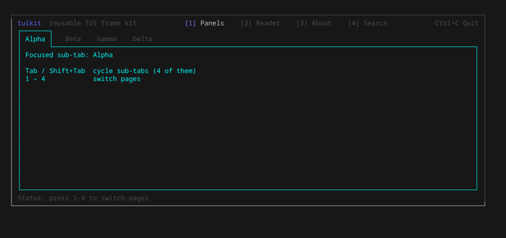
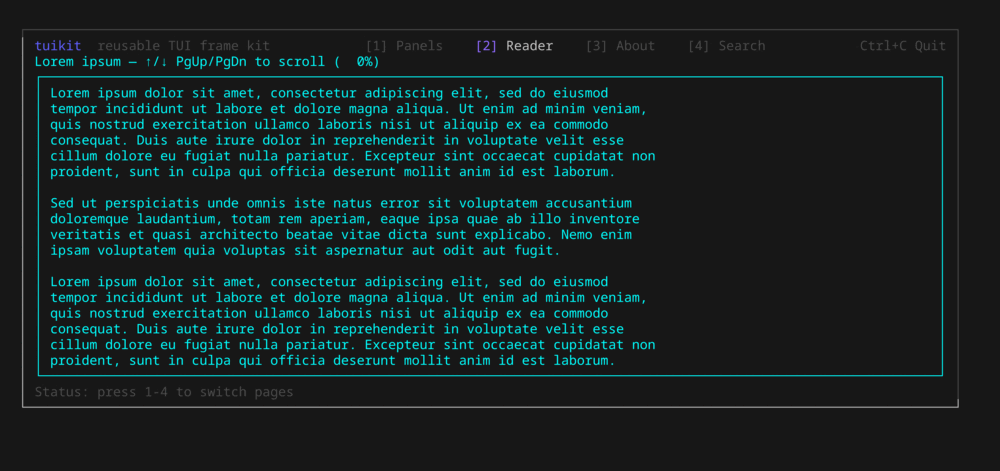
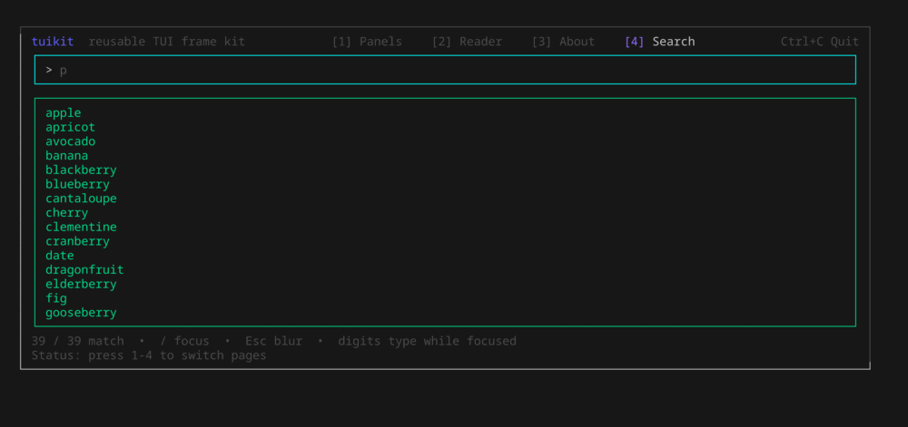
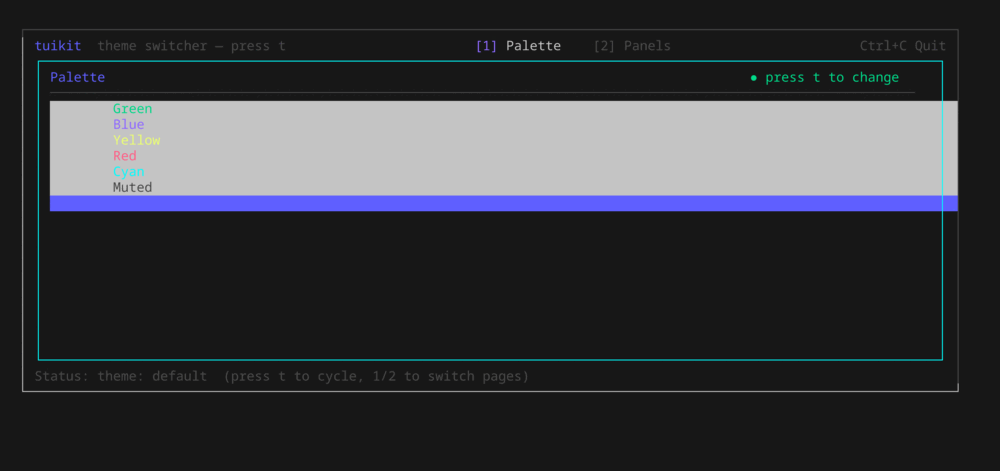
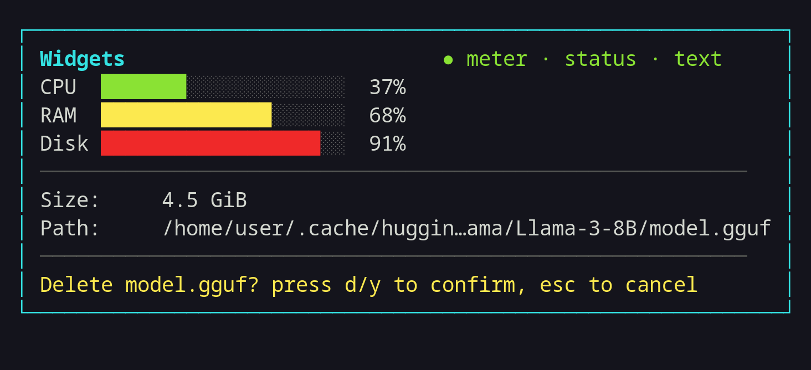

# tuikit

A small, reusable [Bubble Tea](https://charm.land) frame kit: the structural
chrome you rebuild in every terminal app — a numbered page wrapper with
navigation, chip tabs, and bordered panels — decoupled from any one app and
driven by a swappable theme.

## Demos

From `go run ./examples/demo` (and `./examples/themed` for the last one):

| Chip sub-tabs (`Tab` cycles) | Scrolling viewport |
| --- | --- |
|  |  |

| SearchView, ActionRow, and Help | Live theme switching (`t`) |
| --- | --- |
|  |  |

<details>
<summary>Static screenshots</summary>

| Panels | Search |
| --- | --- |
|  |  |

| Reader | About |
| --- | --- |
|  |  |

| Widgets (Meter · Status · text helpers) | |
| --- | --- |
|  | |

</details>

## Components

- **`Frame`** — a stateful `tea.Model` that hosts a list of pages, renders a
  numbered header (`[1] Foo  [2] Bar …`), delegates the body to the active page,
  and draws a status footer. Number keys `1`–`9` switch pages; `Ctrl+C` quits.
- **`Page`** — the seam you implement, a plain 3-method interface:
  ```go
  type Page interface {
      Title() string
      Update(msg tea.Msg) tea.Cmd
      View(width, height int) string
  }
  ```
  Size is passed into `View`, so pages never track their own dimensions.
  Optionally implement `InputCapturer` so the Frame stops treating number keys
  as navigation while a field is focused.
- **`Theme`** — the palette every component draws from. `DefaultTheme()` or roll
  your own and pass `WithTheme`.
- **`TabStrip`** — a row of active/inactive chip tabs for sub-navigation within
  a page.
- **`Panel`** / **`PanelStyle`** — bordered panels with a focused state.
- **`SearchView`** — a scrollable text pane with an incremental substring
  filter and follow-to-bottom behavior: feed it lines, it renders the matching
  subset, stays pinned to the bottom as new lines arrive (until you scroll up),
  and toggles a search input on `/`. Matching is against each line's visible
  text (ANSI styling is stripped first), so colored lines still search cleanly.
  The log/reader viewport every terminal app rebuilds by hand.
- **`ActionRow`** — a labelled row of selectable actions (`Actions:  Start
  [Stop]  Restart`); the selected action is bracketed and highlighted when the
  row is focused, muted otherwise.
- **`Help`** / **`HelpLine`** — a `bubbles/help` model with brighter key and
  description colors than the dim bubbles default, plus a one-line short-help
  renderer.
- **`Meter`** — a fixed-width horizontal gauge (filled/empty bar, no percentage
  label) over `bubbles/progress`, clamped to 0–100. The CPU/RAM/disk dial every
  dashboard needs.
- **`Status`** — the "press again to confirm" destructive-action flow bundled
  with the success/error message it leaves behind: `Confirm` arms then fires,
  `SetResult` records the outcome, `AppendRows` renders it in the theme's colors.
- **Layout & text helpers** — `StatusTitle`, `Field`, `Rule`, `VerticalSlice`,
  `Flow`, `AdaptiveWidth` (responsive column width), `TruncMiddle` (rune-aware
  middle-ellipsis), `FormatBytes` (IEC sizes), and `EmptyPanel` (placeholder).

## Usage

```go
frame := tuikit.New(
    tuikit.WithBrand("myapp", "does a thing"),
    tuikit.WithPages(newHomePage(), newSettingsPage()),
    tuikit.WithStatus(func() (string, tuikit.Level) { return "Ready", tuikit.LevelInfo }),
)
tea.NewProgram(frame).Run()
```

## Docs

- [docs/examples.md](docs/examples.md) — copy-paste snippets for every component.
- Package overview / API reference: `go doc github.com/antonikliment/tuikit`.

## Demo

```sh
go run ./examples/demo    # pages, tabs, reader, SearchView, ActionRow, Help, Meter/Status
go run ./examples/themed  # live theme switching — press t to cycle palettes
```

Number keys switch pages; on the Panels page `Tab` switches sub-panels; on the
Search page `/` focuses the field (and digits then type instead of navigating).

## License

[MIT](LICENSE)
