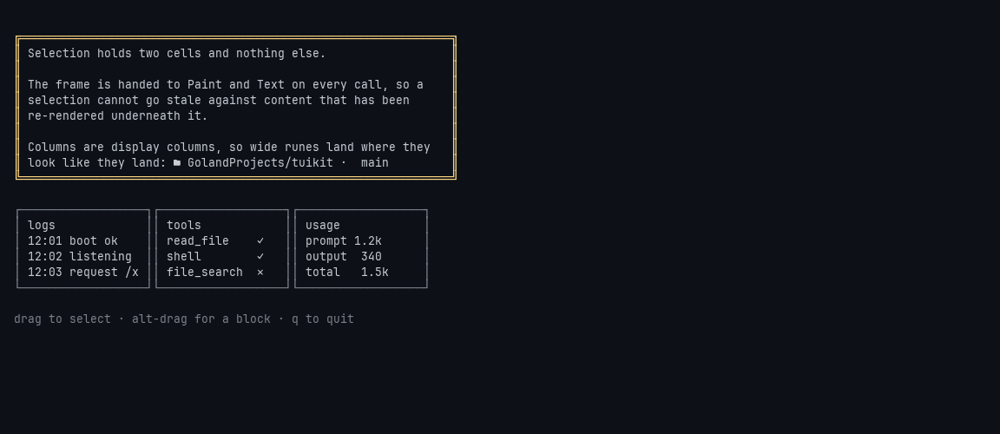
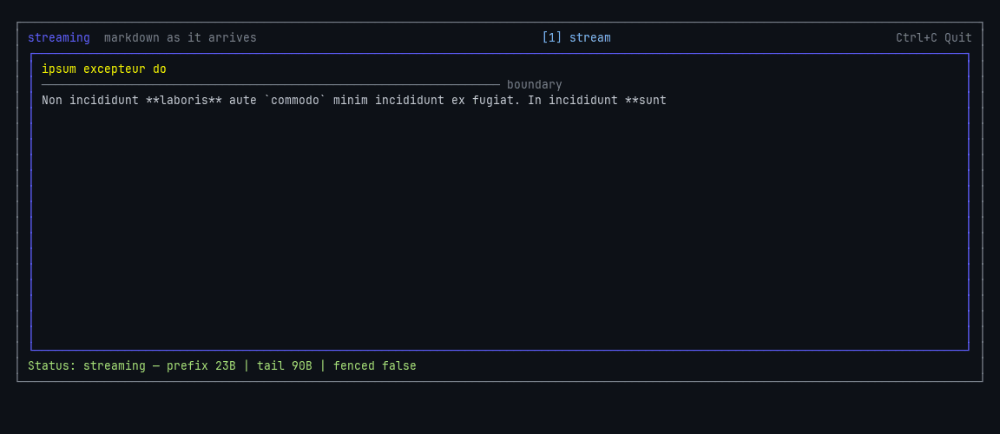
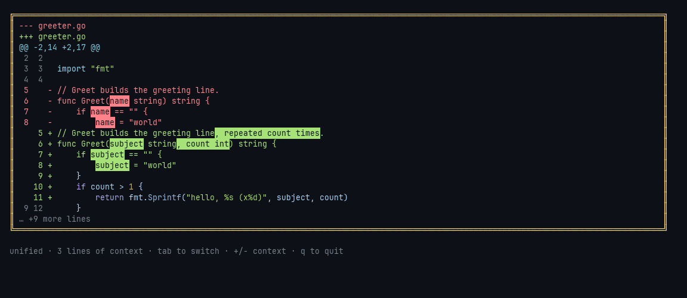
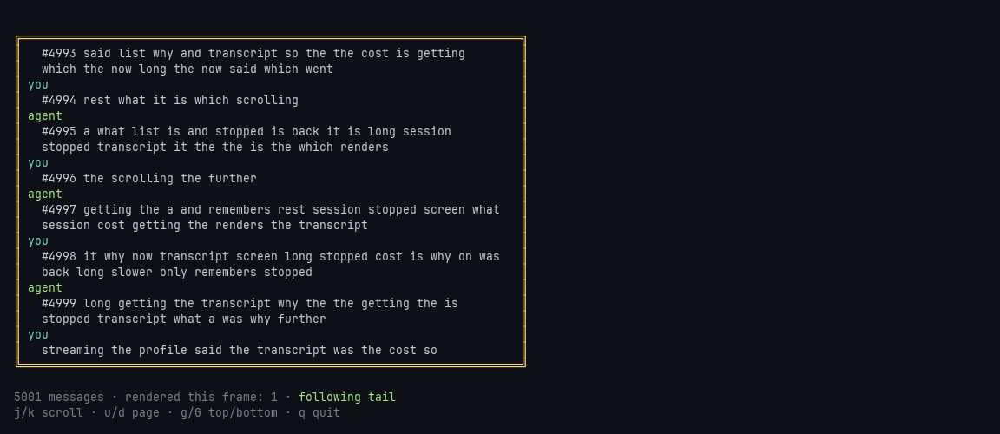
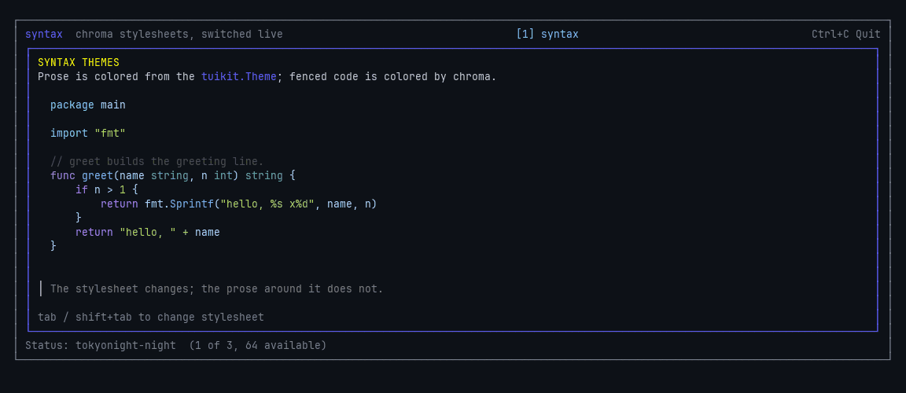
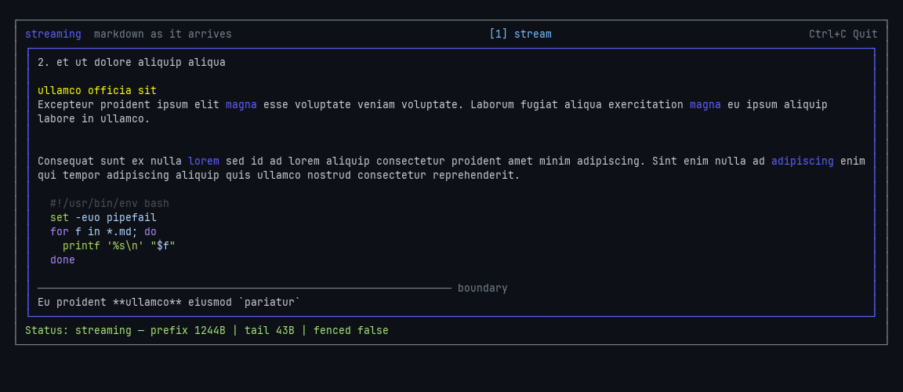
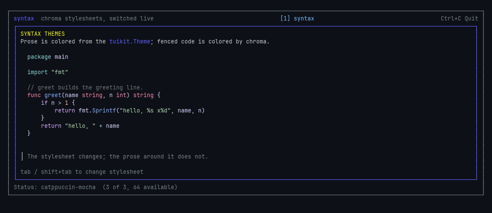

# tuikit

[](https://github.com/antonikliment/tuikit/actions/workflows/ci.yml)
[](https://github.com/antonikliment/tuikit/actions/workflows/security.yml)
[](https://pkg.go.dev/github.com/antonikliment/tuikit)
[](https://goreportcard.com/report/github.com/antonikliment/tuikit)

A small, reusable [Bubble Tea](https://charm.land) frame kit: the structural
chrome you rebuild in every terminal app — a numbered page wrapper with
navigation, chip tabs, and bordered panels — decoupled from any one app and
driven by a swappable theme.

## Demos

From `go run ./examples/demo` (and `./examples/themed` for the last one):

| Chip sub-tabs (`Tab` cycles) | Scrolling viewport |
| --- | --- |
|  |  |

| SearchView, ActionRow, and Help | Live theme switching (`t`) |
| --- | --- |
|  |  |

`Table`, `Pairs` and the formatters, with a simulated transfer driving `Meter`
and `TransferredBytes`. The `STATE` words are graded by `StatusWord` — green,
amber, red — and cost the columns beside them nothing, because widths are
measured by display width rather than by string length:


`Overlay`, a modal popup composited over the page. `p` pins it to each of the
nine anchors in turn and `hjkl` nudges it off one; the page underneath never
reflows, and closing it leaves the page exactly as it was:


`Selection`, from `go run ./examples/selection`. Capturing the mouse takes drag
events away from the terminal, and its own text selection with them — so the app
draws one. Dragging paints the range in place and releasing copies it, echoed in
the footer:



`StreamingMarkdown`, from `go run ./examples/streaming`. A generated document
arrives a character at a time; blocks that have settled are formatted and
cached, and the unfinished tail is rendered too, with whatever constructs it
leaves open closed synthetically. Watch a code fence arrive already
chroma-highlighted, and no `**` or backticks ever reach the screen — the answer
never sits unformatted waiting for the stream to end:



The same demo's `-reveal` flag runs a rejected alternative: settled blocks played
out on a display clock so nothing unfinished is ever drawn, paced by an adaptive
playout buffer that sizes itself from the observed gap between blocks. It removes
the reflow and still freezes inside a long fence, which is why it stayed in the
demo — measurements and the reasoning are in
[docs/notes/streaming-reveal.md](docs/notes/streaming-reveal.md).

`DiffView`, from `go run ./examples/diffview`. A file edit rendered unified or
side-by-side, line-numbered on both sides, highlighted by chroma, and — this is
the part a plain `+`/`-` diff leaves to the reader — with the changed words
inside a modified line pair picked out, so a renamed identifier is visible
rather than hidden in an otherwise identical line. `tab` switches layouts; below
100 columns the side-by-side layout falls back to unified rather than truncating
both halves. Diffing and highlighting are memoized per width and layout, since a
static diff should not be recomputed every frame.


`MemoList`, from `go run ./examples/memolist`. A 5,000-message transcript in a
20-line viewport: only the visible window is rendered, each message's block is
memoized by ID and revision, and the tail is followed until you scroll up. Watch
the counter in the footer — "rendered this frame" stays in single digits through
paging and jumps to the top, and while only the streaming tail changes it is 1,
not the length of the scrollback:



Fenced code is highlighted by chroma, and which stylesheet it uses is a choice —
`markdown.SyntaxThemes` lists the 64 that ship, so an app can offer them. From
`go run ./examples/syntax`, cycling three of them with `tab`. The light one is in
the cycle to show what a stylesheet mismatched to the terminal looks like:



Switching means building a new render function — `markdown.New` captures the
stylesheet — and a new `StreamingMarkdown`, whose cache is keyed on source and
width alone and would otherwise keep serving the previous palette for blocks
whose source never changes again.

<details>
<summary>Static screenshots</summary>

| Panels | Search |
| --- | --- |
|  |  |

| Reader | About |
| --- | --- |
|  |  |

| Widgets (Meter · Status · text helpers) | Table (Table · Pairs · StatusWord) |
| --- | --- |
|  |  |

| Overlay (modal popup, pinned right) | Streaming markdown (boundary shown) |
| --- | --- |
|  |  |

| Syntax stylesheets (catppuccin-mocha) | |
| --- | --- |
|  | |

</details>

## Components

- **`Frame`** — a stateful `tea.Model` that hosts a list of pages, renders a
  numbered header (`[1] Foo  [2] Bar …`), delegates the body to the active page,
  and draws a status footer. Number keys `1`–`9` switch pages; `Ctrl+C` quits.
- **`Page`** — the seam you implement, a plain 3-method interface:
  ```go
  type Page interface {
      Title() string
      Update(msg tea.Msg) tea.Cmd
      View(width, height int) string
  }
  ```
  Size is passed into `View`, so pages never track their own dimensions.
  Optionally implement `InputCapturer` so the Frame stops treating number keys
  as navigation while a field is focused.
- **`Theme`** — the palette every component draws from. `DefaultTheme()` or roll
  your own and pass `WithTheme`.
- **`TabStrip`** — a row of active/inactive chip tabs for sub-navigation within
  a page.
- **`Panel`** / **`PanelStyle`** — bordered panels with a focused state.
- **`SearchView`** — a scrollable text pane with an incremental substring
  filter and follow-to-bottom behavior: feed it lines, it renders the matching
  subset, stays pinned to the bottom as new lines arrive (until you scroll up),
  and toggles a search input on `/`. Matching is against each line's visible
  text (ANSI styling is stripped first), so colored lines still search cleanly.
  The log/reader viewport every terminal app rebuilds by hand.
- **`StreamingMarkdown`** — markdown rendered while it is still arriving. Blocks
  that have provably settled are formatted and cached; the unfinished tail is
  redrawn each frame with its open constructs closed synthetically, so a partial
  code fence streams *highlighted* and no raw markers are ever visible, instead
  of the whole answer popping into shape at the end. `WithRawTail` opts out. Takes a `RenderFunc`; `tuikit/markdown`
  provides one backed by glamour, in a separate package so importing tuikit does
  not pull in a markdown engine. Fenced code is highlighted by chroma;
  `markdown.WithSyntaxTheme` picks the stylesheet.
- **`Selection`** — a mouse drag over a rendered frame. It holds two `Cell`s
  and nothing else: the frame is handed to `Paint` and `Text` on every call, so
  a selection cannot go stale against content re-rendered underneath it. `Paint`
  highlights the range in place and keeps every line's display width; `Text`
  returns what a copy gesture should put on the clipboard. Columns are display
  columns throughout, so wide runes and styled cells land where they look like
  they land.
- **`Overlay`** — a dismissable floating panel: a titled, bordered, scrollable
  box drawn *over* the host's view rather than stacked above or below it, for
  the reference output (a help table, a usage report) that otherwise has nowhere
  to go but the main content stream. `Render` returns a frame of exactly the
  size it was given, so adopting one changes no layout math; `Align` pins it to
  any of nine anchors with a cell-wise nudge; `Help` adds host bindings to the
  hint row, which is always drawn — a modal with no visible way out is a trap.
- **`ActionRow`** — a labelled row of selectable actions (`Actions:  Start
  [Stop]  Restart`); the selected action is bracketed and highlighted when the
  row is focused, muted otherwise.
- **`Help`** / **`HelpLine`** — a `bubbles/help` model with brighter key and
  description colors than the dim bubbles default, plus a one-line short-help
  renderer.
- **`Meter`** — a fixed-width horizontal gauge (filled/empty bar, no percentage
  label) over `bubbles/progress`, clamped to 0–100. The CPU/RAM/disk dial every
  dashboard needs.
- **`Status`** — the "press again to confirm" destructive-action flow bundled
  with the success/error message it leaves behind: `Confirm` arms then fires,
  `SetResult` records the outcome, `AppendRows` renders it in the theme's colors.
- **`Table`** / **`Pairs`** — a header and `[][]string` body in, an aligned
  block out: widths measured over the header too, header upper-cased and muted.
  `Pairs` is the one-dimensional case, for key/value data. Both are built on
  `Columns`, `JoinCells`, `Pad` and `Widest`, which stay exported for layouts
  they do not cover. All measure with `ansi.StringWidth`, so a styled cell
  aligns like its plain equivalent instead of padding by the length of its
  escape sequence.
- **`Painter`** — `PainterFor(w)` decides once whether output may carry escapes
  (`w` is a terminal, `NO_COLOR` unset) and returns `Paint` or `Plain`, so no
  call site repeats that test — or gets it subtly different, which is how half a
  command's output ends up coloured. `Plain` also keeps test assertions readable.
- **`ClassifyStatus`** / **`StatusWord`** — grade a status word into a `Level`
  and paint it: green for a healthy state, red for a failure, amber for anything
  unfamiliar, so an operator only reads the words that are not green.
- **Layout & text helpers** — `Titleize` (`running_profiles` → `Running
  profiles`), `StatusTitle`, `Field`, `Rule`, `VerticalSlice`,
  `Flow`, `AdaptiveWidth` (responsive column width), `Indent`/`IndentLines`,
  `TruncMiddle` (rune-aware middle-ellipsis), `FormatBytes` (IEC sizes),
  `TransferredBytes` ("4.1 GiB / 6.6 GiB"), `CoarseDuration` (three significant
  figures), `Age` ("3m0s ago"), and `EmptyPanel` (placeholder).

## Usage

```go
frame := tuikit.New(
    tuikit.WithBrand("myapp", "does a thing"),
    tuikit.WithPages(newHomePage(), newSettingsPage()),
    tuikit.WithStatus(func() (string, tuikit.Level) { return "Ready", tuikit.LevelInfo }),
)
tea.NewProgram(frame).Run()
```

## Docs

- [docs/examples.md](docs/examples.md) — copy-paste snippets for every component.
- [scripts/record.py](scripts/record.py) — regenerates the gif and screenshot above.
- Package overview / API reference: `go doc github.com/antonikliment/tuikit`.

## Demo

```sh
go run ./examples/demo    # pages, tabs, reader, SearchView, ActionRow, Help, Meter/Status, Table/Pairs, Overlay
go run ./examples/streaming -seed=7 -cps=80 -block=3 -debug   # StreamingMarkdown under an endless generated stream
go run ./examples/themed  # live theme switching — press t to cycle palettes
go run ./examples/syntax  # chroma stylesheets for fenced code — press tab to cycle
go run ./examples/selection # drag to select and copy, painted by the app
```

Number keys switch pages; on the Panels page `Tab` switches sub-panels; on the
Search page `/` focuses the field (and digits then type instead of navigating); on
the Table page any key starts the simulated transfer; on the Overlay page `p`
pins the popup to the next anchor and `hjkl` nudges it.

## License

[MIT](LICENSE)
