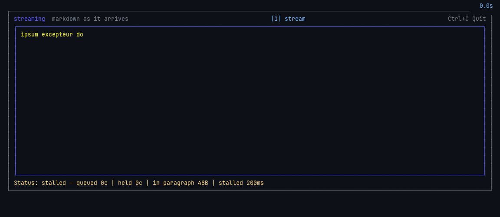
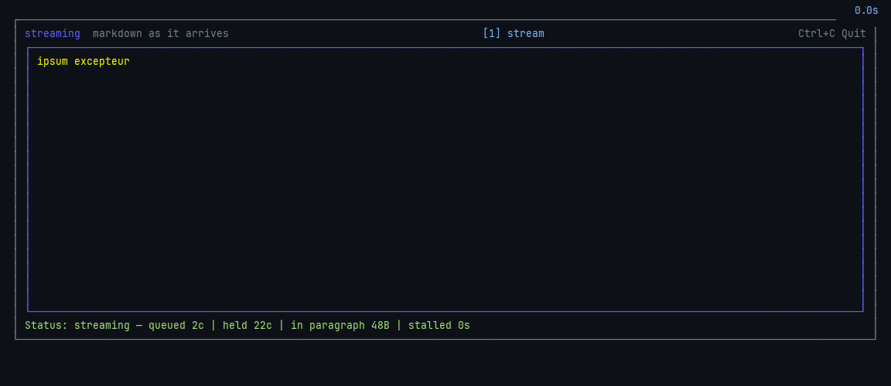

# Revealing rendered markdown on a clock

Status: **prototyped in the demo, with an adaptive playout buffer; still not
recommended for the kit.** The scan fix landed, the reveal clock was built
behind `-reveal` in `examples/streaming`, its freeze was measured, and an
adaptive buffer was then built to close it. The buffer works on chat-sized
documents and only halves the pathological case. What follows is the original
reasoning, then what each round actually showed.

## Where this comes from

`StreamingMarkdown` renders settled blocks and shows the unfinished tail as raw
text. The tail is transient — the next frame replaces it — which is what makes
streaming safe here where it was not safe for a pipe. The residual cost is that
a settling block *reflows*: a list gains bullets and indent, a fence gains a
margin, a table gains borders and two lines of height. Raw markdown is also
briefly visible: `**bold**`, backticks, fence markers.

Two ideas have been raised for reducing that.

1. **A buffer** — hold back the cut until N bytes past the boundary.
2. **Mimicked streaming** — never show raw text at all. Buffer the arriving
   bytes, render whole blocks as they complete, and reveal that *rendered*
   output progressively on a display clock. The buffer provides a lead: bytes
   arrive faster than they are revealed, so a finished block is usually queued
   while the display is still playing out the previous one.

## On the buffer alone: no

A buffer does not remove reflow, it batches it — fewer, larger jumps, for the
same total change in layout. It is also the exact knob that sank glow's `--flow`
proposal ([PR #823](https://github.com/charmbracelet/glow/pull/823)): the
maintainer's objection was that having the user pick a buffer size "is a bit
weird", and their testing found small values corrupted output.

Most settling is invisible anyway. A prose paragraph wraps identically raw and
rendered with no indent, so nothing moves — only the inline styling arrives.
Reflow is confined to lists, fences, tables and block quotes, which argues for a
construct-specific fix rather than a global delay.

## On mimicked streaming: real, but it trades our best case away

What it genuinely buys, and no cheaper option does: **reflow goes to zero.** Not
reduced — eliminated, because only already-final output is ever drawn. The
raw-markdown flash goes with it. That is strictly better than giving the tail
the shape its block will have once settled (spec'd in the comment on `Render`),
which only approximates the final form.

The cost is the case this design currently wins on. A forty-line fence arriving
over ten seconds produces nothing renderable until it closes, so the reveal
queue empties and the display stalls — reintroducing exactly the freeze the glow
author concluded was unfixable without support from glamour. Today that fence
streams as plain text and snaps to highlighted.

Escapes, in increasing order of work:

- Fall back to the raw tail inside an open fence. Cheap, but the visuals change
  mode mid-answer — styled reveal, raw, styled — and both paths need
  maintaining.
- Highlight the partial fence directly. The info string names the language, so
  chroma can lex the partial body without goldmark, and the fence can stream
  *highlighted*. Fences are the one construct where partial rendering is
  genuinely tractable. It is a second rendering path.

## The parts that are harder than they look

**Resize.** The reveal position lives in rendered coordinates, and those do not
survive a width change — re-render at a new width and character offset N is
somewhere else entirely. The position has to be tracked in *source* coordinates
and the output re-rendered and re-sliced on every resize. Slicing styled output
also has to avoid cutting an escape sequence in half; `x/ansi` handles that
part.

**It stops being a pure function.** `Render(text, width)` is currently a
function of its arguments plus a cache. A reveal clock makes it a stateful
animation that the host must drive with ticks, which is a real API shift and sits
against the kit's norm that a component takes size as an argument and keeps no
state of its own.

**Backpressure.** If arrival outruns reveal, the lag grows without bound. The
display rate has to scale with the backlog, and snap to the end when the turn
completes. Standard, but it is policy that has to be designed and tuned.

**Background rendering is probably a non-problem.** Rendering one block through
glamour has not been measured here, but at roughly one block per few hundred
milliseconds it is not plausibly the bottleneck. The substantive idea is the
display clock; the asynchrony is not load-bearing. Measure before building it.

## Measured: the scan was quadratic — fixed

`boundaryOf` re-scanned the whole prefix for link-reference definitions at every
candidate blank line, and it runs every frame even when the cache hits. It now
carries a link-reference flag and the last non-blank line through a single
forward pass, and holds a candidate cut until the following line proves it is
not a setext underline — the only rule that needed to look ahead.
`BenchmarkBoundaryOf`, on a corpus of settled blocks:

| Buffer | Before | After |
| --- | --- | --- |
| 1 KB | 24 µs | 7 µs |
| 9 KB | 809 µs | 45 µs |
| 74 KB | 49 ms | 368 µs |

Eight times the input is now eight times the time. Behaviour is unchanged,
checked differentially against the previous implementation over random documents
at every prefix length.

The second fix — skipping the already-settled region, which the monotonic-
advance test proves is safe — is no longer worth its state. 368 µs a frame on a
buffer nothing realistic reaches is not a cost worth caching against.

## Built: the reveal clock, behind `-reveal`

`examples/streaming/reveal.go`, roughly 200 lines, no library API:

```
go run ./examples/streaming -seed=7 -cps=200 -debug            # raw tail
go run ./examples/streaming -seed=7 -cps=200 -debug -reveal    # display clock
```

Settled chunks are rendered once as they settle and queued; a second clock plays
the queue out a cell at a time, cutting styled output on cell boundaries with
`ansi.Truncate` so no escape is ever halved. Progress is counted in whole
chunks plus an offset into the one playing, which is what makes resize
survivable: finished chunks stay finished and only the head's offset is clamped,
so a width change costs at most one chunk of position. `Step` raises the rate
with the backlog, `Flush` snaps to the end for turn completion (`f` in the
demo), and a rewritten buffer drops the queue rather than splicing two answers
together.

It delivers exactly what was predicted: **reflow is zero and no raw markdown is
ever visible.** Every claim in the section above about what the idea buys holds.

## What it cost: the stall is worse than predicted

`TestRevealStallsWhileALongBlockIsStillArriving` runs the seeded stream
headlessly at 200 cps for twenty seconds and counts the ticks where the queue is
empty while bytes are still arriving — the display frozen mid-answer.

| Blocks | Stalled | Freezes over 500 ms | Longest freeze |
| --- | --- | --- | --- |
| `-block=3` (chat-sized) | 18% | 2 | 1.8 s |
| `-block=12` (long fences) | 84% | 2 | 11.3 s |

The `-block=12` number is the one that settles it. Eleven seconds of a
completely static screen while an answer is actively streaming is the freeze the
glow author concluded was unfixable without glamour support, and this design
reintroduces it wholesale. The raw tail is showing text throughout that same
window.

Even the chat-sized case is not clean: 18% of the stream frozen, with a 1.8 s
pause. A stall is not visible if the display has merely caught up for a few
frames, which is why the table counts freezes over half a second separately —
those are the ones a viewer reads as a hang.

## Round two: an adaptive playout buffer

The freeze above is a buffer underrun — a bursty producer feeding a
constant-rate consumer — so the fix came from the two literatures that own that
problem. Four commits, each reviewable on its own:

1. **`classify`** — what the unsettled tail is inside: nothing, paragraph,
   container, or fence. The distinction that matters is the fence, whose end
   nothing bounds. Every streaming markdown parser surveyed (incremark,
   semidown, mdstream, CommonMark Appendix A) keeps an equivalent open-block
   stack; this is that stack flattened to the one question the policy asks.
2. **`gapEstimator`** — RFC 3550's exponentially weighted mean and deviation,
   with settle gaps as the samples. `Reserve() = mean + 4·deviation`. Gaps are
   badly skewed — mostly short paragraphs, the occasional long fence — so the
   mean alone is nowhere near the value that has to be covered.
3. **The rate map** — buffer-based rate adaptation (Huang et al., SIGCOMM 2014):
   steer off buffer occupancy alone, do not predict the producer. Two regions
   rather than the paper's three, because its bottom region is a flat floor at
   the lowest rate and a flat floor still drains to empty, which is the failure
   being fixed. Below the reserve the drain is *proportional*, so the queue
   decays toward empty rather than hitting it — the display keeps moving through
   a drought. That is what adaptive VoIP playout does when it time-scales speech
   instead of letting the buffer run dry; on a text display it costs nothing.
4. **Word-boundary release** — the head snaps back to the last whole word, as
   Vercel's AI SDK does in `smoothStream`. A word appearing at once reads as
   typing; a word assembling letter by letter reads as a machine.

### Where the open construct comes in, and where it does not

The obvious shape — a small buffer until an opening marker is seen, then a long
one until the closing marker — cannot work as stated, and the code deliberately
does something else. A buffer grown in reaction to seeing a fence would have to
be built out of bytes arriving *during* the fence, and nothing settles during a
fence. That is the entire problem. A reserve can only be spent if it was already
held.

So the reserve is held continuously, and the open construct sets **how hard to
brake**, not when to buffer: fence 3×, container 1.5×, prose 1×, with the
reserve floored inside a fence at the wait so far, since the drought to date is
the best lower bound on the drought remaining.

### Measured

Twenty seconds of seeded stream at 200 cps, from `TestRevealPacing`. A freeze is
a run of ticks in which the *visible* head does not move — not a tick that
advanced no cells, since a conserving policy deliberately moves the head by less
than a cell a tick, and not an empty queue, which is reported separately as an
underrun.

| Blocks | `-hold` | Longest freeze | Freezes > 500 ms | Underrun | Lag held |
| --- | --- | --- | --- | --- | --- |
| 3 | 0 (off) | 1.83 s | 5 | 5.55 s | — |
| 3 | 0.5 | 1.19 s | 1 | 1.29 s | 548 c |
| 3 | **1** | **1.00 s** | **1** | **1.10 s** | 1096 c |
| 3 | 2 | 0.62 s | 1 | 0.71 s | 2193 c |
| 3 | 4 | 0.70 s | 1 | 0.11 s | 4386 c |
| 3 | 8 | 1.06 s | 2 | 0.11 s | 8772 c |
| 12 | 0 (off) | 11.74 s | 2 | 17.29 s | — |
| 12 | **1** | **5.14 s** | **2** | 5.25 s | 697 c |
| 12 | 8 | 2.61 s | 7 | 2.57 s | 5576 c |

Two things to read off it.

**It works on the realistic case.** At chat-sized blocks the longest freeze
halves and the number of noticeable freezes goes from five to one, for about a
second of steady-state lag.

**The response is U-shaped.** Past `-hold=2` the freezes get *worse* again while
the underrun keeps falling — the queue is no longer empty, the policy is simply
braking so hard the head crawls. Too little reserve starves the display; too
much throttles it. A rate floor was tried to flatten the right-hand side: it
helps there and causes starvation where material is scarce, and does nothing at
the default, so it was not kept.

### Watch it

The same seed and rate recorded both ways, at chat-sized blocks. The recorder
stamps a clock on every frame and keeps sampling while the screen is unchanged,
because the thing being compared is how long the display stops moving — a still
frame cannot show it, and a GIF that drops unchanged frames hides it.

Round one, `-hold=0`: five freezes over half a second, the longest 2.0 s.



With the adaptive buffer, `-hold=1`: two freezes, the longest 0.8 s. The status
bar shows the reserve it is holding to pay for that.



```
RECORD=reveal-eager    scripts/record.py docs/gifs/reveal-eager.gif    /tmp/eager.png \
    -- ./streaming -seed=7 -cps=200 -block=3 -reveal -debug -hold=0
RECORD=reveal-buffered scripts/record.py docs/gifs/reveal-buffered.gif /tmp/buffered.png \
    -- ./streaming -seed=7 -cps=200 -block=3 -reveal -debug
```

**It does not rescue the pathological case.** At `-block=12` the freeze only
halves, and the reason is not the policy — underrun tracks the freeze almost
exactly, meaning the queue is genuinely empty. There is no reserve to hold
because nothing settled to put in one. A buffer cannot manufacture material.

## Conclusion

Still do not put the clock in the kit, and do not make it the demo's default —
but the reasoning has moved.

The adaptive buffer is a real improvement and is the right structure: no
user-facing knob (which is what sank glow's `--flow`, where the maintainer's
objection was making the user pick a size), self-sizing from observed behaviour,
and grounded in two literatures that have solved this exact shape. On a
chat-sized answer it brings the display close to smooth.

What it does not do is make the clock better than the raw tail, because the
remaining freeze is on long fences and no amount of buffering reaches it. The
raw tail shows text throughout that same window. The trade is still reflow —
cosmetic, mostly invisible on prose — against multi-second freezes on code.

The one change that would settle it is the escape the first round already
identified, now with a clearer reason to want it:

- **Highlighting the partial fence directly.** The info string names the
  language, so chroma can lex a partial body without goldmark. That is the only
  route to streaming *inside* a fence, it removes the one case the buffer cannot
  reach, and it would improve the raw-tail design too, with or without a clock.
  If anything here graduates to the kit, it is this.
- The cheaper fence fallback — raw tail inside an open fence — would also remove
  the `-block=12` case, at the cost of the visuals changing mode mid-answer.

Everything built here stays in the demo behind `-reveal` and `-hold`. It is
cheap to keep, it is the evidence, and `-hold=0` reproduces the first round's
numbers in the same binary.
